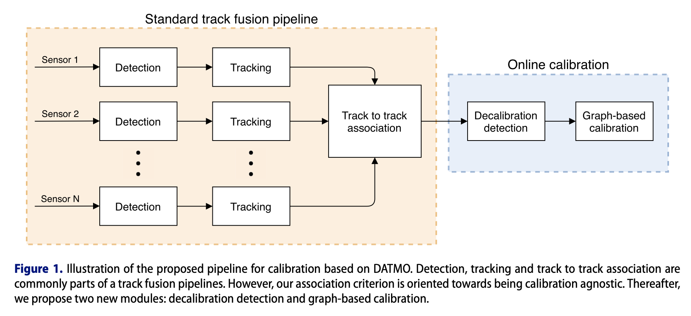

# Online multi-sensor calibration based on moving object tracking

## Abstract

propose an online calibration method based on detection and tracking of moving objects.

resource inexpensive solution  

The methods consists of a calibration-agnostic track to track association, computationally lightweight decalibration detection, and a graph-based rotation calibration.

## 1. Introduction

**DATMO**: detection and tracking of moving objects

sensor calibration consists of finding the intrinsic, extrinsic and temporal parameters.

the online approaches use information from the environment during the regular system operation, thus enabling long term robustness of the autonomous system.

Online calibration methods can be divided into feature-based and motion-based methods.

In this paper, we leverage current state of the art in DATMO and propose an online calibration methods based on it. Our motivation is to enable decalibration detection and recalibration based on the information which is already present in an autonomous system pipeline without adding significant computational overhead.

Our method provides a full pipeline which includes:

1. DATMO algorithm for each sensor modality
2. track-to-track association based on a calibration invariant measure
3. efficient decalibration detection
4. a graph-based calibration handling multiple heterogeneous sensors simultaneously

Refer to **Figure1**.

Our method only estimates rotational component of the extrinsic calibration.

Our method assumes that translational calibration is obtained using either target-based or sensor-specific methods.

## 2. Proposed Method

### 2.1 Object Detection

radars provide a list of detected objects consisting of the following measured information: range, azimuth angle, range-rate, and radar corrs-section(**RCS**). clusters of radars

Lidar's and camera's raw data... use the **MEGVII** network based on sparse 3D convolution, which is currently the best performing method for object detection on the nuScenes challenge.

for the object detection from images, use **CenterNet**, but velocity information is not provided.

use the network weights trained on the KITTI dataset and determined the range scale factor by comparing CenterNet detections to the MEGVII detections.

### 2.2 Tracking of moving objects

associate them between different time frames and provide estimates of their states, which are later  used as inputs for subsequent steps.

### 2.3 Track-to-track association

observe 2 criteria for each track pair candidates through their common history:

1. mean of the velocity norm difference
2. mean of the position norm difference

The track pair has to satisfy both criteria and not surpass predefined thresholds.

time-varying SE(3) transform

### 2.4 Decalibration(解关联) detection

propose a computationally inexpensive decalibration detection methods, which is based on the data already present in the system.

form a 3*3 data matrix...

When the criterion (12) surpasses a predefined threshold, the system proceeds to the complete graph-based sensor calibration. The magnitude of the minimal decalibration that can be detected is limited by the predefined threshold and the horizon defined with the Tw. Longer horizon enables detection of smaller calibraiton changes, but with slower convergence.

### 2.5 Graph-based extrinsic calibration

graph-based optimization 

to ensure  and speed up the convergence, we use the results of the previous step as an initialization.

one sensor is chosen as an anchor and aligned with the Fe for convenience.  We then seasrch for the poses of other sensors with respect to the anchor sensor by minimizing the following criterion(13)(14)

total least squares approache

if a sensor does not have a direct link with the anchor sensor, obtain (i,j)R by multiplying the corresponding series of rotation matrices to obtain the final rotation between the i-th and j-th sensor. This approach enables the estimation of all parameters with a single optimization, while ensuring consistency between sensor transforms.

## 3. Experimental results

real world data-> nuScenes dataset

### 3.1 Experimental setup

1000 scenes that are 20s long

a roof-mounted 3D lidar, 5 radars, 6 cameras. But focus only on the top lidar, front radar and front camera which all share a common FOV.

speed of ego vehicle: stationary at first 5s; 40km/h after.

17 moving vechicles

8 stationary vehicles in the detectable area for all the sensors.

### 3.2 Results

In comparison to the camera, lidar provided significantly more detections with frequent false positives(误报) which we successfully filtered by setting a threshold on their detection scores.

MEGVII network detects and classifies the same object as both car and truck..

the radar provide many false positives and multiple detections of the same vehicles.

RCS is not a reliable measure for vehicle classification..

the success rate for each sensor pair was as follows:

- lidar-radar 93%

- lidar-camera 94%
- radar-camera 94%

Average time for 2 tracks is 1.5s for every sensor combination. decalibration did not lead to any noticeable difference in results.

criterion for each sensor pair is below 1° throughout the scene.

artificial decalibration of 3° in the yaw angle...

We can notice a significant increase in the criterion for the sensor pairs involving the camera, while the criterion for lidar-radar remained the same.

able to assess which sensor change its orientation by simply comparing the sensor-pairwise criteria.

### 3.3 Comparison with odometry-based calibration

tested **SRRG** method in [36]

## 4. Conclusion

1. proposed an online multi=sensor calibration method based on detection and tracking of moving objects.
2. on a moving platform without relying on a known target; does not assume a constant and known sensor calibration.
3. proposed track to track association...
4. graph based optimization

limited to rotation calibration only. Nevertheless, it was able to estimate rotation parameters with an approximate error of 0.2◦ from a 20 s long scene.

## Comprehension

目标关联使用位置和速度的相关性。我们之前做过后融合部分，根据目标在84坐标系的位置进行关联，这个方法要人为设置一个门限，关联后，就找到了匹配的几个点，然后就是3d-2d转换。
declibration部分，意思是开始关联上了，一路记录关联，当解关联的时候就开始利用关联的数据做标定，解关联可能是遮挡或者目标出了范围，解关联开始出发计算calibration。可能是想积累更多的匹配数据，理论上数据在FOV分布越均匀，标定精度越高。

## Words

|Word|Definition|phonetic symbol|
|--|--|--|
|pipeline|管道||
|ego-motion|自我情感  ||
|rotational |旋转的||
|heterogeneous |异质的||
|leverage  |杠杆作用v. n.||
|exteroceptive |  外感||
|stationary |稳定的||
|thrust |推力 v. n. ||
|FOV |Field of View||
|degradation| 降解||
|mutually |相互||
|substantial |重大的||
|association| 组合||
|conservative| 保守||
|compromise |妥协，折中||
|loose | 松动的||
|trivial |琐碎的，细小的||
|discrete |离散的||
|accommodate| 容纳||
|disturbance| n. 干扰，扰乱，骚扰||
|coincide |重合||
|convergence| 收敛||
|magnitude |大小，震级，量级||
|paradigm |范例||
|isotropic |各向同性||
|parentheses| 括号||
|Nevertheless| 尽管如此||

